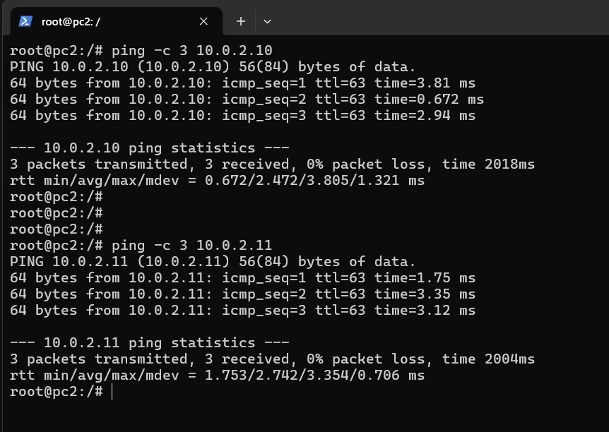
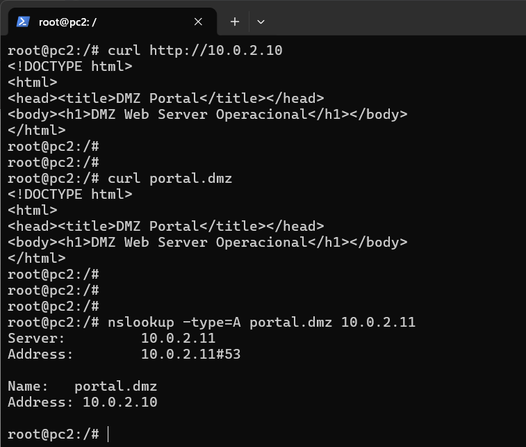
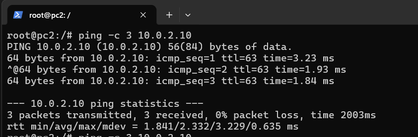
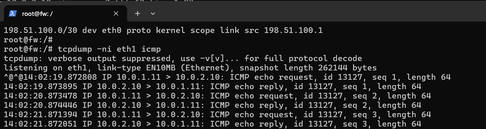

## 1. Implemente a topologia

Reproduza a topologia no Kathará, configurando os dispositivos e redes apresentados na figura.

Configure:

- ``r0`` — roteador de borda e acesso à Internet;
- ``fw`` — firewall/middlebox;
- ``pc1`` e ``pc2`` — estações da LAN;
- ``web`` — servidor Web na DMZ;
- ``dns`` — servidor DNS na DMZ;
- rede de gerenciamento — opcional.

Inicialmente, **não configure regras restritivas no firewall**. Configure endereçamento, roteamento e acesso à Internet.

### Validação inicial

Após iniciar o laboratório com `kathara lstart` no diretório desta etapa, execute os testes abaixo nos
respectivos dispositivos. Os endereços usados são os definidos nos scripts `startup`.

#### 1. LAN → Internet

No `pc1`, verifique o gateway, a rota padrão e a conectividade externa:

```bash
ip route
ping -c 3 8.8.8.8
```

O teste é válido quando a rota padrão aponta para `10.0.1.1` e há respostas do
endereço externo. No `r0`, confirme que o encaminhamento IPv4 e o NAT estão ativos:

```bash
sysctl net.ipv4.ip_forward
iptables -t nat -L POSTROUTING -n -v
```


#### 2. LAN → DMZ

No `pc1`, teste o servidor Web e o servidor DNS da DMZ:

```bash
ping -c 3 10.0.2.10
ping -c 3 10.0.2.11
```

As respostas confirmam que o firewall encaminha tráfego da LAN (`10.0.1.0/24`)
para a DMZ (`10.0.2.0/24`).



#### 3. Serviços Web e DNS

Ainda no `pc1`, valide o HTTP e a resolução do nome configurado no `dns`:

```bash
curl http://10.0.2.10
curl portal.dmz
nslookup -type=A portal.dmz 10.0.2.11
```



O HTTP deve retornar a mensagem `DMZ Web Server Operacional` e o DNS deve
resolver `portal.dmz` para `10.0.2.10`.

#### 4. Encaminhamento no firewall

No `fw`, confirme as interfaces, o encaminhamento IPv4 e as rotas para as redes
internas:

```bash
ip addr
sysctl net.ipv4.ip_forward
ip route
```

Durante um `ping` do `pc1` para `10.0.2.10`, os contadores das interfaces do
firewall também devem registrar tráfego:

```bash
tcpdump -ni eth1 icmp
tcpdump -ni eth2 icmp
```





Esses resultados demonstram que o firewall recebe os pacotes pela LAN e os
encaminha pela DMZ.

Resumo esperado:

- LAN → Internet funciona;
- LAN → DMZ funciona;
- Web e DNS estão acessíveis;
- o firewall encaminha corretamente os pacotes entre as redes;
- o NAT no `r0` permite a saída da LAN para a Internet.

Essa será a **baseline** para os próximos experimentos.