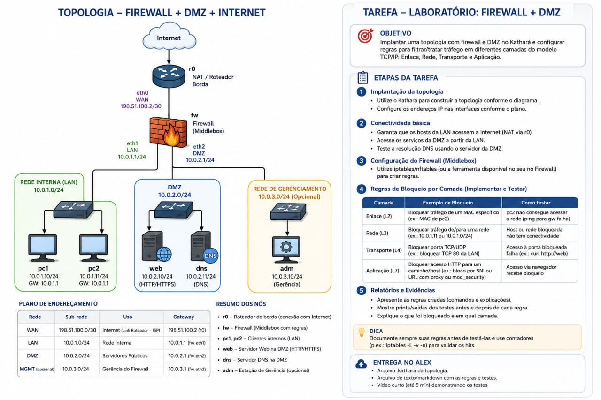

# [2. Implemente a Segurança de Perímetro](2_implemente_a_seguranca_de_perimetro/README.md)

Transforme ``fw`` em um **Firewall de Perímetro**, utilizando ``iptables`` ou ``nftables``.

Adote como princípio:

> Bloquear por padrão e permitir explicitamente apenas as comunicações necessárias.

Implemente, no mínimo, a seguinte política:

| Comunicação | Política |
| --- | --- |
| LAN → Internet | ✅ Permitir |
| LAN → Web/DNS da DMZ | ✅ Permitir |
| Internet → Web da DMZ | ✅ Permitir |
| Internet → LAN | ❌ Bloquear |
| DMZ → LAN (novas conexões) | ❌ Bloquear |
| Respostas de conexões permitidas | ✅ Permitir |

Sempre que apropriado, utilize filtragem stateful para diferenciar novas conexões das respostas pertencentes a conexões já estabelecidas.
